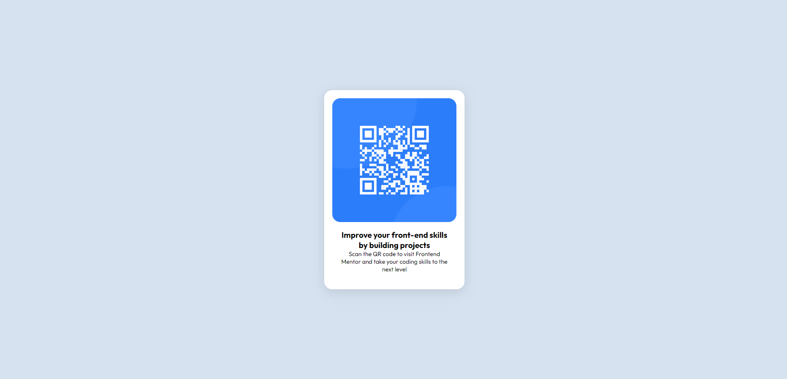

# Frontend Mentor - QR code component solution

This is a solution to the [QR code component challenge on Frontend Mentor](https://www.frontendmentor.io/challenges/qr-code-component-iux_sIO_H). Frontend Mentor challenges help you improve your coding skills by building realistic projects. 

## Table of contents

- [Overview](#overview)
  - [Screenshot](#screenshot)
  - [Links](#links)
- [My process](#my-process)
  - [Built with](#built-with)
  - [What I learned](#what-i-learned)
  - [Useful resources](#useful-resources)
- [Author](#author)


## Overview

### Screenshot



### Links

- Solution URL: [Add solution URL here](https://your-solution-url.com)
- Live Site URL: [Add live site URL here](https://your-live-site-url.com)

## My process

### Built with

- Semantic HTML5 markup
- CSS custom properties
- Flexbox


### What I learned

During the process of center the qr-code box, i learned that i have to use display flex in 
the div referent to the qr-code box and also in an external div.


```css
main{
    display: flex;
    justify-content: center;
    align-items: center;
    background-color: var(--light-gray) ;
    height: 100vh;

   
}

.box-qr-code{
    border-radius: 20px ;
    
    background-color: var(--white);
    padding: 2rem;

    display: flex;
    flex-direction: column;
    justify-content: center;
    align-items: center;

    width: 35rem;
    /* height: 50rem; */

    box-shadow: rgba(100, 100, 111, 0.2) 0px 7px 29px 0px;

    margin-left: 2rem ;
    margin-right: 2rem ;
   
   
}
```


### Useful resources

- [Example resource 1](https://getcssscan.com/css-box-shadow-examples) - This helped me to find a box-shadow similar to the example.


## Author

- Frontend Mentor - [@Evertonneto](https://www.frontendmentor.io/profile/Evertonneto)
- LinkedIn - [Everton Nunes](https://www.linkedin.com/in/everton-nunes-36a9a021a/)


